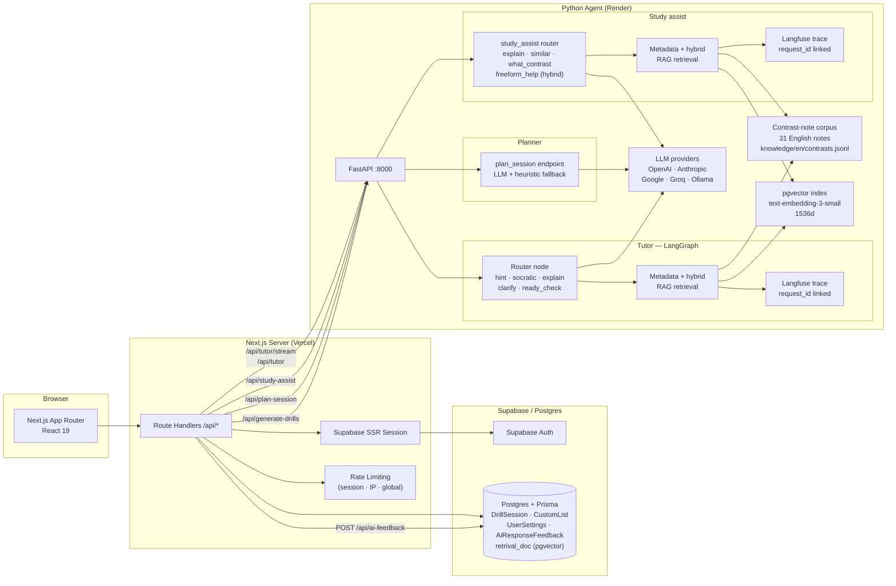

# LinguaFlow — AI Language Coaching System

[](https://github.com/JefferyLiu6/fsi-2026/actions/workflows/ci.yml)
[](https://nextjs.org/)
[](https://react.dev/)
[](https://www.typescriptlang.org/)
[](https://www.python.org/)

> **Live demo:** https://linguaflow-demo.vercel.app

LinguaFlow is a full-stack AI language-learning system built as a portfolio project. It combines timed drills, a LangGraph-orchestrated tutor, a session planner, a retrieval-augmented coaching layer (metadata + pgvector hybrid), a Study-mode assistant, and a helpfulness-feedback loop — all wired together across a Next.js web app, a FastAPI agent, Supabase Auth, and Postgres.

---

## Review this project in 5 minutes

**Fastest path (no account needed):**

1. Go to https://linguaflow-demo.vercel.app
2. Click **Begin Training** → choose English → run a 4-item session
3. On the Results screen, look at the **Next session recommendation** (planner)
4. Click a drill item → open the **Coach** tab → ask "Explain this" → look for the **Coach reference** label

**Authenticated path (planner + RAG + feedback loop):**

1. Sign in with the reviewer account:
   - Email: `reviewer@linguaflow.demo`
   - Password: `LinguaFlow2026!`
2. The dashboard loads with 12 pre-seeded sessions — the planner fires immediately
3. Run an English session → Results → see the AI-generated session plan
4. Open Coach on an English card → ask "Explain this" or "Why is this wrong?" → grounded reply with **Coach reference** and 👍/👎
5. Visit **Study** on an English card → click "Explain card" or "What contrast is this?" → grounded reply with **Study reference** and 👍/👎
6. Click 👍 or 👎 — feedback persists to the database and is reportable

---

## System architecture

LinguaFlow is split across four layers: Next.js (UI + API routes), Supabase Auth + Postgres (persistence), a FastAPI Python agent (LLM logic, LangGraph, RAG), and an optional Langfuse trace sink.



---

## Feature highlights

### 1. Contrastive RAG (Tutor + Study, Phase 1–3)

The tutor's `explain` and `clarify` routes, and the Study assistant's four actions, are grounded by a curated 31-note English contrast corpus. Retrieval is metadata-first (drill `id`, `type`, `category`, `topic`, taxonomy tags, authoring item IDs); when the metadata score is below a strong-hit threshold (8), the system runs a hybrid pgvector rerank (0.6 × vector + 0.4 × normalized metadata).

The frontend surfaces grounding lightly: a "Coach reference" or "Study reference" label shows the matched note title. The full trace is recorded in Langfuse with the same `request_id` that flows back to the UI as `responseId`, so every grounded reply can be joined to its retrieval trace.

**Retrieval eval results** (31-case metadata harness, 25-case freeform harness):

| metric | metadata baseline | hybrid (freeform) |
|---|---|---|
| hit rate | 0.90 | — |
| exact note match | 0.94 | — |
| true no-hit rate | 1.00 | — |
| false positive rate | 0.00 | — |
| freeform exact match | — | +12 pp vs metadata |

### 2. Session planner (Phase 1)

After each English session, the Results screen shows an AI-generated plan card recommending what to practice next, with a confidence score and fallback to a deterministic heuristic when the LLM output is below threshold (0.85, calibrated from a 30-case eval sweep). The planner uses the last 5 sessions and the full English taxonomy as context.

### 3. Helpfulness feedback loop (Phase 4)

Authenticated users can rate any grounded Tutor or Study reply as 👍 or 👎. The rating is persisted in `AiResponseFeedback` and linkable to the Langfuse trace via `responseId = request_id`, enabling the full proof loop:

```
learner clicks 👎
  → AiResponseFeedback row: { sourceId, surface, mode, responseId }
  → Langfuse trace filtered by request_id: what note was retrieved, why
  → fix note's when_to_use or tags
  → re-run eval → helpful rate improves
```

Internal report: `DATABASE_URL=... npx tsx scripts/feedback-report.ts`

### 4. LangGraph tutor orchestration

The tutor uses a router-plus-specialist graph. The router classifies learner intent into one of five routes; LangGraph conditional edges dispatch to the matching specialist node. Each node applies route-specific prompting policy. The streaming path (`/tutor/stream`) reuses the same router and specialists but delivers incremental SSE tokens.

---

## Animated demo


---

## Screenshots

**Home — drill session widget and language picker**


**Drill feedback + AI Tutor coaching exchange**


**Dashboard — rolling accuracy, response time, training intensity heatmap**


> Screenshots showing the planner card (Results screen), grounded Study reply with helpfulness feedback, and a grounded Tutor reply with the Coach reference label are pending capture from the live deployment.

---

## Iteration history

### Phase 1 — Timing + core loop
Implemented the strict drill loop (20s timer, submit/skip/timeout, immediate feedback, session scoring). Validated UX mechanics before adding architecture complexity.

### Phase 2 — Data contracts + Prisma persistence
Added typed Next.js API routes and Prisma models (`DrillSession`, `CustomList`, `UserSettings`). Decoupled UI from data logic; established stable request/response contracts.

### Phase 3 — Isolated FastAPI generation service
Introduced a separate FastAPI service with guided/raw generation modes, JSON extraction, and output filtering. AI failures are isolated from the web app.

### Phase 4 — LangGraph tutor routing
Replaced one-shot tutoring with LangGraph routing (5 specialist nodes, hint-level state, structured JSON output with fallback). Makes tutor behavior controllable and debuggable.

### Phase 5 — Auth, reliability, and security hardening
Added Supabase Auth + Postgres persistence, JWT-cookie session handling, protected data routes, turn caps, input validation, and clearer upstream error mapping.

### Phase 6 — SSE streaming + deployment prep
Added `/tutor/stream` SSE endpoint. Streaming path reuses router + specialist policies and delivers incremental tokens with runtime metadata (`route`, `hint_level`, `elapsed_ms`).

### Phase 7 — Contrastive RAG (metadata, Phase 1a/1b)
Built a 31-note English contrast corpus and a metadata-first retrieval scorer (drill id, type, category, topic, taxonomy tags, authoring item IDs). Added a 31-case eval harness with per-bucket metrics. Grounded `explain` and `clarify` routes. Added `Coach reference` label to the tutor panel.

### Phase 8 — Session planner
Added `POST /plan-session` and the LangGraph planner graph (LLM plan + heuristic fallback + confidence threshold). Planner card appears on Results after each English session.

### Phase 9 — Study mode + Study-assist RAG
Added the Study screen (card flip, progress tracking) and the `/study-assist` endpoint with four actions (`explain_card`, `show_similar_examples`, `what_contrast_is_this`, `freeform_help`). Study-mode RAG reuses the Phase 7 corpus.

### Phase 10 — Hybrid pgvector retrieval (Phase 3)
Added `text-embedding-3-small` embeddings, a pgvector `retrieval_doc` table, offline sync (`python -m retrieval.sync_embeddings`), and hybrid reranking (0.6 × vector + 0.4 × normalized metadata). Freeform help uses vector-first retrieval. 25-case freeform eval harness with head-to-head metadata vs hybrid comparison.

### Phase 11 — Helpfulness feedback loop (Phase 4)
Added `response_id` plumbing (`Next.js → Python → SSE done event`), `AiResponseFeedback` model, `POST /api/ai-feedback`, and inline 👍/👎 controls on grounded replies. Feedback rows are linkable to Langfuse traces via `responseId`.

### Phase 12 — Portfolio packaging (Phase 5)
Reviewer-oriented README, deployment runbook, seed/reset script for the shared demo account, and CI upgrade from per-file `py_compile` to `pytest`.

---

## API surface (web layer)

| Method | Path | Purpose | Auth |
|---|---|---|---|
| POST | `/api/register` | Create account + issue Supabase session | Open |
| POST | `/api/auth/login` | Sign in + issue Supabase session | Open |
| POST | `/api/auth/logout` | Clear Supabase auth cookies | Signed-in |
| GET | `/api/auth/me` | Return normalized auth state | Open |
| GET/POST | `/api/sessions` | Load or upsert authenticated drill sessions | Signed-in |
| GET/PUT/DELETE | `/api/custom-list` | Load or replace the authenticated custom list | Signed-in |
| GET/PUT | `/api/language` | Load or save language preference | Signed-in |
| POST | `/api/import-demo-data` | Import guest browser data into authenticated account | Signed-in |
| POST | `/api/plan-session` | Proxy to Python planner with rate limits | Open |
| POST | `/api/generate-drills` | Proxy to Python generation with rate limits | Open |
| POST | `/api/tutor` | Proxy to Python tutor (non-streaming) with rate limits | Open |
| POST | `/api/tutor/stream` | Proxy to Python SSE tutor stream with rate limits | Open |
| POST | `/api/study-assist` | Proxy to Python study-assist with rate limits | Open |
| POST | `/api/ai-feedback` | Persist helpfulness feedback for a grounded reply | Signed-in |

---

## Data model

```
DrillSession       — user-scoped session performance (results JSON, drill type, language)
CustomList         — one persisted custom list per user
UserSettings       — language preference
AiResponseFeedback — 👍/👎 signal linked to responseId and retrieval trace
retrieval_doc      — pgvector document store for hybrid RAG (managed via psycopg2)
```

Supabase owns identity. All app tables use the Supabase user UUID as `userId`.

The first version intentionally stored session results and custom-list items as JSON because that matched the frontend payloads and kept iteration fast. As planner logic, analytics, and review flows grew, that shape became harder to query, index, and evolve safely.

The next hardening step is to normalize per-item learning data into relational tables while keeping session-level aggregates in `DrillSession`. That preserves the current product behavior but gives the system a better story around query design, indexing, migrations, and backfills.

See:
- [docs/CASE_STUDY_DATA_MODEL.md](docs/CASE_STUDY_DATA_MODEL.md) for the full current-vs-ideal schema walkthrough
- [docs/ENGINEERING_NOTES.md](docs/ENGINEERING_NOTES.md) for recent engineering fixes
- [docs/BACKLOG.md](docs/BACKLOG.md) for still-open hardening work

---

## Tech stack

| Area | Technologies |
|---|---|
| Frontend | Next.js 16, React 19, Tailwind CSS 4 |
| Web backend | Next.js Route Handlers, TypeScript |
| AI backend | FastAPI, LangGraph, LangChain |
| LLM providers | OpenAI · Anthropic · Google · Groq · Ollama |
| Retrieval | Hand-authored 31-note corpus, metadata scorer, pgvector hybrid |
| Auth | Supabase Auth with SSR cookie handling |
| Data | Supabase Postgres + Prisma (pooled + direct) |
| Tracing | Langfuse (fail-open) |
| Testing | Vitest (73 unit/integration), Pytest (110 agent), Playwright E2E |
| CI | GitHub Actions: lint · tsc · vitest · build · playwright · pytest |

---

## Local development

### Prerequisites

- Node.js 20+, pnpm
- Python 3.11+
- A Supabase project (optional — guest mode works without it)
- An LLM provider key (e.g. `OPENAI_API_KEY`) for the agent

### 1. Web app (guest mode)

```bash
pnpm install
pnpm dev
```

Open `http://localhost:3000`. Guest mode works immediately — no database or auth setup required.

### 2. Authenticated mode

Create a Supabase project, disable email confirmation, and add to `.env.local`:

```bash
NEXT_PUBLIC_SUPABASE_URL=...
NEXT_PUBLIC_SUPABASE_PUBLISHABLE_KEY=...
DATABASE_URL=...       # pooled connection string
DIRECT_URL=...         # direct connection string
```

Run migrations:

```bash
npx prisma migrate deploy
```

### 3. Python agent

```bash
cd agent
python -m venv .venv && source .venv/bin/activate
pip install -r requirements.txt
cp .env.example .env        # add OPENAI_API_KEY (or another provider key)
uvicorn main:app --port 8000 --reload
```

Health check: `curl http://localhost:8000/health`

### 4. (Optional) Hybrid RAG with pgvector

```bash
# Sync corpus embeddings to the database
cd agent
DATABASE_URL=... OPENAI_API_KEY=... python -m retrieval.sync_embeddings
```

The agent falls back to metadata-only retrieval if this step is skipped.

---

## Environment variables

See `.env.example` (web) and `agent/.env.example` (agent) for the full list with descriptions.

**Web app minimum (authenticated mode):**

| Variable | Description |
|---|---|
| `NEXT_PUBLIC_SUPABASE_URL` | Supabase project URL |
| `NEXT_PUBLIC_SUPABASE_PUBLISHABLE_KEY` | Supabase anon key |
| `DATABASE_URL` | Pooled Postgres URL |
| `DIRECT_URL` | Direct Postgres URL (Prisma CLI) |
| `AGENT_URL` | Python agent base URL |

**Agent minimum:**

| Variable | Description |
|---|---|
| `OPENAI_API_KEY` | LLM key for default model |

---

## Scripts

| Command | Purpose |
|---|---|
| `pnpm dev` | Start dev server |
| `pnpm build` | Production bundle |
| `pnpm test` | Vitest unit/integration suite |
| `pnpm test:e2e` | Playwright E2E (guest mode; authenticated skips without env vars) |
| `npx tsx scripts/seed-demo-account.ts <userId>` | Seed or reset the reviewer demo account |
| `npx tsx scripts/feedback-report.ts` | Print helpfulness rates by surface, mode, source note |
| `python -m pytest tests/ -q` | Full agent test suite (110 tests, mocked externals) |
| `python -m retrieval.sync_embeddings` | Sync corpus embeddings to pgvector |
| `python -m retrieval.eval_runner` | Run retrieval eval harness |
| `python -m retrieval.eval_runner --arm freeform` | Freeform eval + metadata-vs-hybrid comparison |

---

## CI

CI runs on every push and PR (`/.github/workflows/ci.yml`):

| Step | What it checks |
|---|---|
| `pnpm lint` | ESLint |
| `npx tsc --noEmit` | TypeScript |
| `pnpm test` | Vitest (73 tests) |
| `pnpm build` | Next.js production build |
| `pnpm test:e2e` | Playwright (guest flow; authenticated flow skips without env vars) |
| `pytest tests/ -q` | Full Python agent suite (110 tests, all mocked) |

---

## Deployment

See [`docs/DEPLOYMENT.md`](docs/DEPLOYMENT.md) for the full runbook covering:
- Supabase setup and migration order
- Render agent deploy
- Vercel web app deploy
- Embedding sync
- Reviewer account seeding and reset

---

## Engineering highlights

### 1. Typed cross-service bridge

The Next.js API layer maps camelCase frontend payloads to Python snake_case contracts and maps responses back. This keeps the UI ergonomic without sacrificing strict backend contracts.

### 2. LangGraph tutor with retrieval-grounded nodes

The tutor graph routes each learner message to a specialist node. Only `explain` and `clarify` run retrieval — `hint`, `ready_check`, and `socratic` never touch the corpus, preventing answer leakage and keeping grading deterministic.

### 3. Metadata-first RAG with hybrid fallback

The retriever scores notes by metadata overlap first. If the top score exceeds a threshold, the vector path is skipped entirely (faster + no embedding cost for known items). Hybrid reranking only kicks in for novel items where metadata is weak.

### 4. End-to-end response_id linkage

`crypto.randomUUID()` is generated in the Next.js proxy, forwarded as `request_id` to Python, echoed back as `response_id` in the response body and in the SSE `done` event, and persisted as `responseId` in `AiResponseFeedback`. This makes every feedback row joinable to its Langfuse trace without any out-of-band correlation step.

### 5. Fail-open everywhere

DB unavailable → metadata-only retrieval. Embedding API down → metadata-only retrieval. Langfuse credentials unset → no tracing, behavior unchanged. LLM planner below confidence threshold → deterministic heuristic. The system has no hard dependencies on optional infrastructure.

---

## License

MIT © JL200126 — see [LICENSE](LICENSE).
