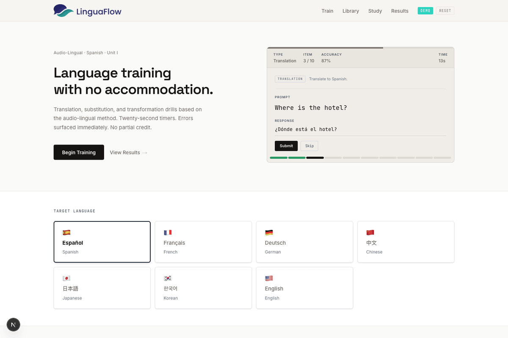
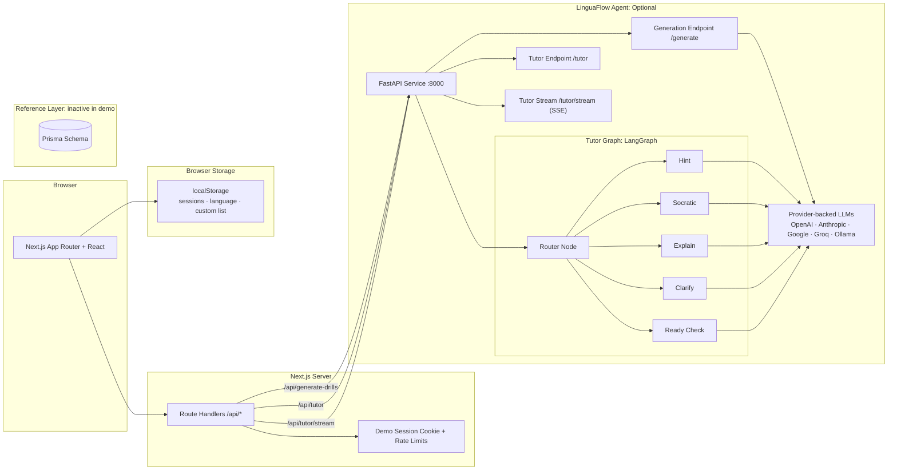
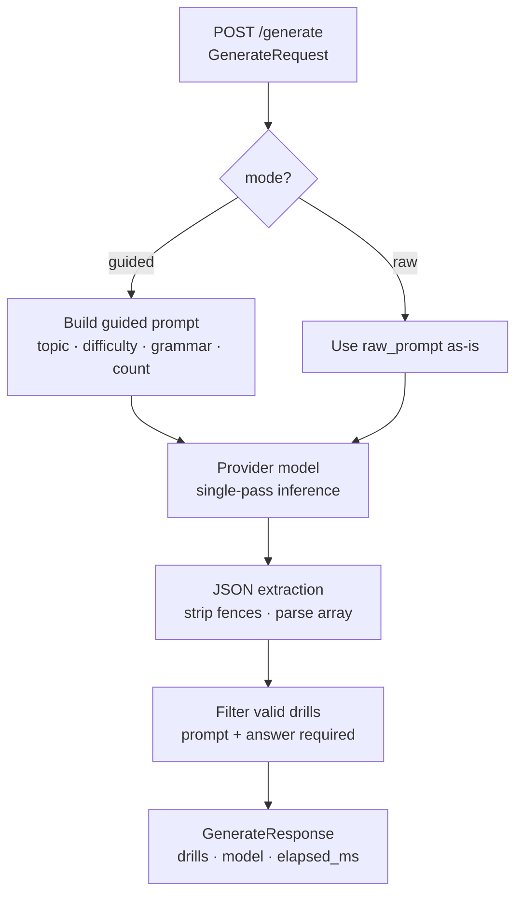
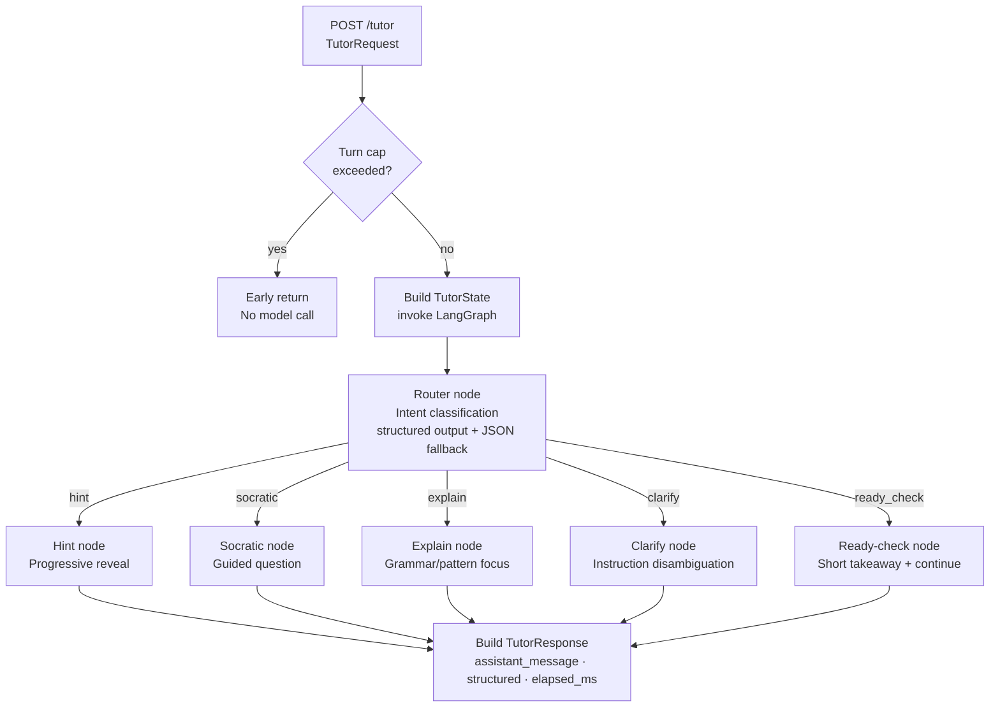
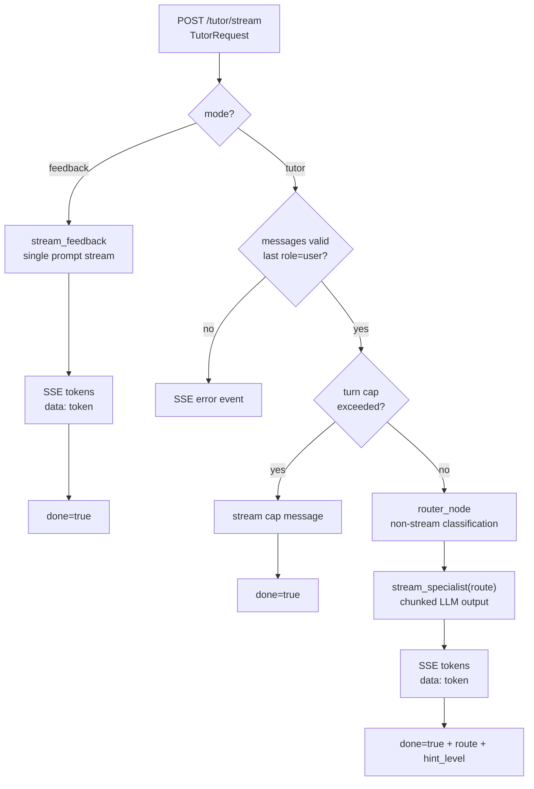

# LinguaFlow — AI Language Coaching System

[](https://github.com/JefferyLiu6/fsi-2026/actions/workflows/ci.yml)
[](https://nextjs.org/)
[](https://react.dev/)
[](https://www.typescriptlang.org/)
[](https://www.python.org/)
[](https://nodejs.org/)
[](https://pnpm.io/)
[](LICENSE)

> **Live demo:** https://linguaflow-demo.vercel.app · [Walkthrough video](#) _(placeholder)_

Try it out: https://linguaflow-demo.vercel.app

LinguaFlow is a product-style language learning demo that combines timed drills, route-aware AI coaching, and progress tracking.
The current public checkout runs in demo mode: learner progress, language preference, and custom lists are stored in the browser, while the optional Python agent powers drill generation and tutoring.

## Key Highlights

- **Product scope**: timed drills, custom lists, dashboard analytics, and coaching workflows.
- **AI architecture**: FastAPI agent + LangGraph routing + deterministic JSON handling.
- **System design**: typed Next.js <-> Python API bridge with clear service boundaries.
- **Engineering quality**: CI checks for lint, type safety, tests, build, and Python syntax.

## Current Demo Mode

- **No account required**: auth is disabled in this public demo checkout.
- **Per-browser progress**: sessions, selected language, and custom drill lists are stored in `localStorage`.
- **Optional AI backend**: `/api/generate-drills` and `/api/tutor*` proxy to the Python agent when it is running.
- **Prisma schema retained for reference**: the repo still includes the earlier Prisma data model, but the current demo build does not use it at runtime.

## Animated Demo



## Screenshots

**Home — drill session widget and language picker**


**Drill feedback + AI Tutor coaching exchange**


**AI Drill Generation — raw prompt mode with live preview**


**Results dashboard** — rolling accuracy, response time, training intensity heatmap


## System Architecture

LinguaFlow is split into two active runtime layers plus one dormant reference layer: a Next.js app for UI and route handlers, browser-side demo persistence via `localStorage`, and an optional FastAPI AI service for drill generation and tutoring.
The repo also retains a Prisma schema from an earlier iteration, but that persistence layer is not active in the current public demo build.



## Iteration History

Note: the iteration history below includes earlier auth and Prisma-backed persistence work. The current public demo checkout ships with those pieces stubbed out so the app can run as a lightweight browser-first demo.

### v1 — Timing + Feedback Loop First
- **What changed:** Implemented the strict core loop (20s timer, submit/skip/timeout paths, immediate feedback, session scoring).
- **Why:** Validate learning mechanics first before adding architecture or AI complexity.
- **Impact:** Confirmed UX viability and exposed the next bottleneck: non-persistent local state.

### v2 — Data Contracts + Persistence Boundary
- **What changed:** Added typed Next.js API routes plus Prisma models (`DrillSession`, `UserSettings`, `CustomList`).
- **Why:** Decouple UI rendering from data logic and establish stable request/response contracts.
- **Impact:** Deterministic persistence, cleaner component boundaries, and a foundation for multi-user flows.

### v3 — Isolated AI Service for Generation
- **What changed:** Introduced a separate FastAPI generation service with guided/raw modes, JSON extraction, and output filtering.
- **Why:** Keep AI failures isolated from the web app and make model/provider iteration easier.
- **Impact:** Safer AI integration; malformed model output is filtered before entering user sessions.

### v4 — Tutor Control via LangGraph
- **What changed:** Replaced one-shot tutoring with LangGraph routing (`hint`, `socratic`, `explain`, `clarify`, `ready_check`) and hint-level state.
- **Why:** Make tutor behavior controllable and resilient under ambiguous learner messages.
- **Impact:** More consistent coaching behavior through structured routing, JSON fallback, and safe defaults.

### v5 — Reliability, Security, and Failure Handling
- **What changed:** Added JWT cookie auth, protected data routes, turn caps, input validation, and clearer upstream error mapping.
- **Why:** Reduce silent failure paths and harden multi-user behavior before broader usage.
- **Impact:** More production-like reliability with clearer operational failure modes and stronger CI guarantees.

### v6 — Streaming + Deployment Preparation (current)
- **What changed:** Added `/tutor/stream` SSE, plus runtime metadata (`elapsed_ms`, `route`, `hint_level`) for observability.
- **Why:** Improve perceived responsiveness and make runtime behavior measurable for tuning and ops.
- **Impact:** End-to-end system is deployment-ready in architecture; once live, this phase will be labeled **Production Deployment**.

## Product Features

- **Core drills**: translation, substitution, transformation
- **Languages**: Spanish, French, German, Chinese, Japanese, Korean, English
- **User flows**:
  - Run timed drills and receive immediate feedback
  - Track performance on a per-browser dashboard
  - Browse full drill library by language/topic/category
  - Build a custom list by upload or AI generation
- **Optional AI capabilities**:
  - Generate custom drills via local Ollama model
  - Ask AI tutor for hints, explanations, clarifications, and readiness checks

## Tech Stack

| Area | Technologies |
|---|---|
| Frontend | Next.js 16, React 19, Tailwind CSS 4 |
| Backend (Web) | Next.js Route Handlers, TypeScript |
| Backend (AI) | FastAPI, LangGraph, OpenAI / Anthropic / Google / Groq / Ollama support |
| Data | Browser `localStorage` in the current demo; Prisma schema retained in repo as inactive reference |
| Auth | Disabled in the current demo; demo session cookie is used only for AI rate limiting |
| Testing | Vitest unit tests, route-level integration tests, and Playwright E2E coverage for the learner flow |
| CI | GitHub Actions (`lint`, `tsc`, `test`, `build`, `test:e2e`, Python `py_compile`) |

## Runtime Profile

For local development and the public demo, LinguaFlow runs without database-backed auth or persistence. The web app stores learner state in the browser, and AI features are available when the optional Python agent is running.

The intended future production profile is:
- Next.js frontend/web API on Vercel
- FastAPI agent on Render
- Postgres via Prisma
- Hosted LLM provider for reliable inference

This keeps the demo lightweight while preserving a clear migration path to an internet-facing production architecture.

## Model Strategy

- **Default model profile**: `openai/gpt-4o-mini` is the baseline for tutor and generation requests because it is cost-efficient, low-latency, and strong enough for short coaching turns and drill JSON output.
- **Provider abstraction by design**: model IDs use `provider/model` format, so the same request path can run on OpenAI, Anthropic, Google, Groq, or local Ollama without changing endpoint contracts.
- **Structured outputs reduce hallucinations**: the tutor router attempts structured output first, then falls back to JSON parsing, improving route reliability for `hint`, `socratic`, `explain`, `clarify`, and `ready_check`.
- **Deterministic parsing for generation**: drill generation enforces JSON-array extraction plus schema-like field filtering (`prompt`, `answer`, type constraints) before returning results.
- **Multi-model ready for deployment tuning**: the architecture supports switching models per environment (cost, latency, quality) while keeping the frontend/API payload shape stable.

## Evaluation

Benchmark snapshot (local run, 2026-04-03, model: `openai/gpt-4o-mini`):

- **Tutor routing validity**: 15/15 prompts returned a valid route (`hint`, `socratic`, `explain`, `clarify`, `ready_check`) via `/tutor/stream`.
- **Average tutor latency**: 1.97s end-to-end over 15 streaming tutor requests.
- **Generation validity after filtering**: 12/12 generation requests returned non-empty filtered drill sets with required `prompt` + `answer` fields.
- **Average generation latency**: 6.63s over 12 guided generation requests (96 valid drills total).
- **Safety behavior**: invalid/ambiguous outputs remain bounded by route fallbacks (`socratic` default), field filtering, and explicit 4xx/5xx error mapping.

Method notes:
- Tutor benchmark used one-turn coaching prompts and validated the final SSE `route` event.
- Generation benchmark used guided mode across multiple topic/difficulty/grammar combinations.
- These are lightweight operational checks (not a formal offline eval suite), intended to show real runtime behavior on the current stack.

## Engineering Highlights

### 1) Typed cross-service API bridge
The Next.js API layer maps frontend camelCase payloads to Python snake_case contracts and maps responses back to frontend shape. This keeps the UI ergonomic without sacrificing strict backend contracts.

### 2) LangGraph tutor orchestration
The tutor service uses a router-plus-specialists graph:
- router classifies learner intent (`hint`, `socratic`, `explain`, `clarify`, `ready_check`)
- conditional edges dispatch to specialist nodes
- each specialist applies route-specific prompting policy
- guardrails enforce turn limits and stable fallback behavior

### 3) Demo session and guardrails
- The public demo does not require login; app routes are intentionally open
- A lightweight demo session cookie scopes AI-facing rate limits per browser
- AI routes use per-session, per-IP, and optional global daily caps to protect usage

### 4) Reliability workflow
- Unit tests for drill normalization, answer checking, item selection, and stat aggregation
- Route-level integration tests for demo reset, drill generation proxying, and tutor proxying
- Browser E2E coverage for the core learner flow from session start to results dashboard
- CI pipeline validates code health before merge

## Agent System Design

The Python agent exposes two independent sub-systems on the same FastAPI service.

### Drill Generation (single-pass)



### Tutor Endpoint (non-streaming `/tutor`)



### Tutor Streaming Endpoint (`/tutor/stream`)



**Key design decisions:**
- **Guardrail before the graph** — turn cap is enforced in the endpoint, not inside a node, so the LLM is never called unnecessarily
- **Router uses structured output with JSON fallback** — tolerates models that ignore tool-call format
- **Specialist nodes share a single `_run_specialist` helper** — prompting policy is centralized; LangGraph conditional edges select the node
- **`hint_level` increments only on the hint route** — other routes leave it unchanged, preserving progressive-reveal state across turns
- **Streaming path reuses router + specialist policies** — `/tutor/stream` keeps routing behavior aligned while delivering incremental SSE tokens

## API Surface (Web Layer)

| Method | Path | Purpose | Auth |
|---|---|---|---|
| POST | `/api/register` | Demo stub retained for compatibility | No-op in demo |
| POST | `/api/auth/login` | Demo stub retained for compatibility | No-op in demo |
| POST | `/api/auth/logout` | Demo stub retained for compatibility | No-op in demo |
| GET | `/api/auth/me` | Demo stub retained for compatibility | No-op in demo |
| GET/POST | `/api/sessions` | Demo stub; client state lives in `localStorage` | Not used by current UI |
| GET/PUT | `/api/custom-list` | Demo stub; client state lives in `localStorage` | Not used by current UI |
| GET/PUT | `/api/language` | Demo stub; client state lives in `localStorage` | Not used by current UI |
| POST | `/api/generate-drills` | Proxy to Python generation endpoint with demo rate limits | Open |
| POST | `/api/tutor` | Proxy to Python tutor endpoint with demo rate limits | Open |
| POST | `/api/tutor/stream` | Proxy to Python SSE tutor stream endpoint with demo rate limits | Open |

## Data Model

The repo still contains a Prisma schema from an earlier iteration. It includes:
- `User` (identity + credentials)
- `DrillSession` (session performance + serialized results)
- `CustomList` (user-generated drill sets)
- `UserSettings` (preferences such as language)

That schema is currently inactive in the public demo build. Today, learner state is stored in browser `localStorage`; re-enabling Prisma remains a future migration path.

## Local Development

### Prerequisites
- Node.js 20+
- pnpm
- Python 3.10+ (only if running the AI agent)
- Ollama (only if using AI generation/tutor)

### 1) Install and run the web app

```bash
cd linguaflow-demo
pnpm install
pnpm dev
```

Open `http://localhost:3000`.

The current demo web app does not require a database or login setup.

### 2) Run optional AI agent

Terminal A:

```bash
ollama serve
ollama pull llama3.1
```

Terminal B:

```bash
cd linguaflow-demo/agent
python -m venv .venv
source .venv/bin/activate
pip install -r requirements.txt
uvicorn main:app --host 0.0.0.0 --port 8000 --reload
```

Health check:

```bash
curl http://localhost:8000/health
```

## Environment Variables

Create `.env.local` from `.env.example`.

| Variable | Required | Description |
|---|---|---|
| `AGENT_URL` | No | Python agent base URL (default `http://localhost:8000`) |
| `DEMO_AI_*` / `DEMO_GEN_*` / `DEMO_TUTOR_*` | No | Optional demo rate-limit overrides for AI endpoints |
| `DATABASE_URL` | No | Reserved for inactive Prisma scaffolding in this checkout |
| `JWT_SECRET` | No | Reserved for inactive auth scaffolding in this checkout |

## Scripts

| Command | Purpose |
|---|---|
| `pnpm dev` | Start dev server |
| `pnpm build` | Build production bundle |
| `pnpm start` | Start production server |
| `pnpm lint` | Run ESLint |
| `pnpm test` | Run Vitest suite |
| `pnpm test:e2e` | Run Playwright end-to-end coverage for the learner flow |
| `pnpm test:watch` | Run tests in watch mode |
| `pnpm demo:gif` | Re-record the demo GIF to `docs/demo/linguaflow-demo.gif` |

## Quality and CI

- Test files currently live in `lib/*.test.ts`, `app/api/**/*.test.ts`, and `e2e/*.spec.ts`
- CI workflow in `.github/workflows/ci.yml` runs:
  - `pnpm lint`
  - `npx tsc --noEmit`
  - `pnpm test`
  - `pnpm build`
  - `pnpm test:e2e`
  - Python syntax checks for all agent modules

## Production Notes

- If auth is re-enabled, rotate `JWT_SECRET` carefully and serve over HTTPS
- Add stronger auth and abuse controls around AI-heavy routes for internet-facing deployments
- Re-enable server-backed persistence before treating learner history as durable data
- For multi-instance deployments, migrate the dormant Prisma layer to Postgres

## Current Limitations

- AI features depend on local Ollama availability unless replaced with hosted inference
- Auth and Prisma-backed persistence are disabled in the current public demo checkout
- Learner progress is per-browser and can be cleared with local storage reset
- Tutor/generation endpoints currently prioritize demo ergonomics over hardened production policy

## Roadmap

- Add end-to-end tests for critical user flows
- Add observability (request tracing and endpoint latency dashboards)
- Add model routing/fallback policies for AI endpoints
- Re-enable database-backed auth and persistence on top of the retained Prisma schema
- Publish demo deployment and walkthrough video

## License

MIT © JL200126 — see [LICENSE](LICENSE).
