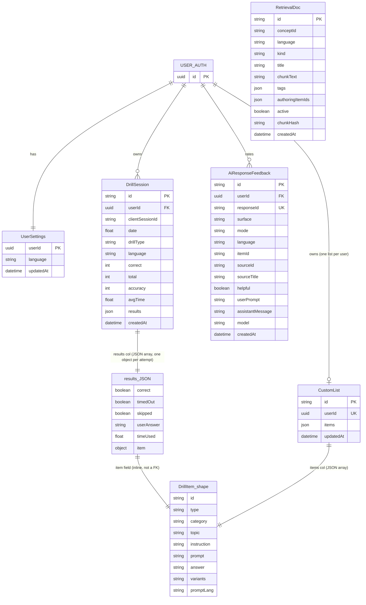
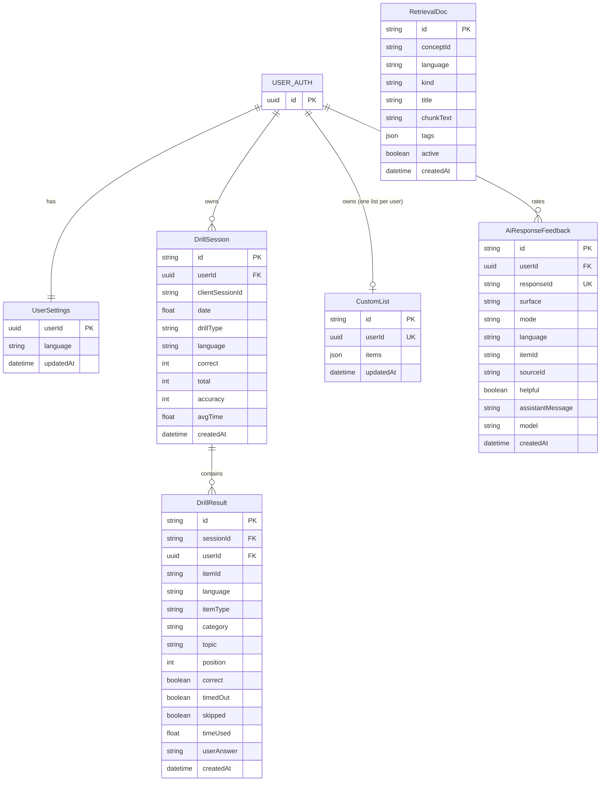

# Data Model Evolution

This note explains how the current data model was implemented, what problems appeared as the product grew, what alternatives were considered, and what the ideal next version should look like.

## Current version

### Graph

> `results` and `items` are both JSON columns. `results_JSON` and `DrillItem_shape` show the **in-memory object shape** stored inside those columns — they are not database tables.
> `CustomList.userId` carries a unique constraint, enforcing one list per user at the database level.
> `DrillSession` carries a `@@unique([userId, clientSessionId])` constraint for idempotent session writes.

### Table

| Model | What it stores now | Good part | SWE downside |
|---|---|---|---|
| `DrillSession` | Session header + all per-item attempts in `results: Json` | Fast to ship; matches frontend payload exactly; idempotent via `(userId, clientSessionId)` unique key | Item-level querying, indexing, and DB validation are all weak |
| `CustomList` | Entire saved drill list in `items: Json`; one row per user enforced by unique key | Simple CRUD, no join logic | Hard to query, dedupe, reorder, or validate item-level structure in DB |
| `UserSettings` | One row per user language preference | Fine as-is | No major issue |
| `AiResponseFeedback` | Helpful / not helpful signals with full context; already relational with compound indexes | Already well-structured; `(userId, responseId)` unique key prevents duplicate ratings | Fine as-is |
| `RetrievalDoc` | RAG chunk store; embedding column managed outside Prisma via pgvector | Indexes on `(language, kind, active)` support retrieval queries | Fine as-is for this phase |

## How the first version was implemented

The first version optimized for product speed:

- the frontend already had working in-memory types for `SessionRecord`, `DrillResult`, and `DrillItem`
- the backend persisted those shapes with minimal translation
- `DrillSession.results` stores `SessionRecord.results` directly
- `CustomList.items` stores validated `DrillItem[]` directly

This was a reasonable decision early on because it minimized:

- mapping code
- migration overhead
- schema design time
- risk while the product surface was still changing quickly

## Problems that appeared

As the app grew, the JSON-heavy parts of the schema became a software-engineering bottleneck.

### 1. Analytics and planner queries are awkward

Questions like these become application-side parsing work instead of normal SQL:

- What topics does a user miss most?
- Which items are repeatedly wrong?
- What is the user’s error rate for English finance transformations?
- Which custom-list items belong to a topic or category?

### 2. Indexing is weak

The app can index `userId`, but it cannot cleanly index nested fields inside `results` or `items` in a way that stays pleasant to maintain.

### 3. Validation lives mostly in app code

The runtime guards in `lib/sessionData.ts` are useful, but the database still cannot strongly enforce nested result shape the way it can with real columns.

### 4. Schema evolution gets harder

If the app later needs fields like:

- `position`
- `hintUsed`
- `source`
- `attemptNumber`
- per-item review state

then the team has to version and backfill JSON payloads instead of evolving relational tables.

### 5. Read models are harder to build

Dashboard stats, planner inputs, and review suggestions all want item-level data. JSON storage forces repeated hydration and transformation work.

## Alternatives considered

### Option A: Keep JSON, add JSONB / GIN indexes

**Pros**

- smallest migration
- keeps current payload shape
- still good for prototyping

**Cons**

- still weak for constraints
- still awkward for joins and analytics
- still reads like a prototype-heavy schema in SWE interviews

### Option B: Fully relational, including a canonical `DrillItem` table

**Pros**

- strong relational consistency
- clear foreign keys
- great query surface

**Cons**

- built-in drill content currently lives in code
- custom/generated items do not naturally share one DB-owned source of truth
- adds synchronization risk between code-defined items and DB-defined items

### Option C: Normalize the high-value mutable data, keep the curriculum in code

**Pros**

- stronger queryability where it matters most
- cleaner migrations and indexes
- no need to move the whole drill corpus into the database
- preserves the current app architecture

**Cons**

- more tables and joins
- more write logic
- requires a careful backfill and route refactor

This is the best fit for the project.

## Ideal version

### Design choice

The best next model is:

- keep `DrillSession` as the session header
- add `DrillResult` as one row per answered item
- keep `CustomList` with `items: Json` — no `CustomListItem` table
- keep built-in drill content in code for now
- store queryable item attributes directly on result rows
- keep `AiResponseFeedback` and `RetrievalDoc` largely unchanged

### Graph

> `DrillResult.userId` is intentionally denormalized from `DrillSession` — it avoids a join on every analytics query.
> `DrillSession` aggregates (`correct`, `total`, `accuracy`, `avgTime`) are kept for fast history reads but must be written atomically with results to prevent drift.
> `RetrievalDoc` has an additional `embedding vector(1536)` column managed outside Prisma via psycopg2 — not shown here because Prisma cannot represent it.

### Table

| Model | Role in ideal design | Why it exists |
|---|---|---|
| `DrillSession` | Session-level aggregate header | Fast history reads and session metadata without joining result rows |
| `DrillResult` | One row per answered drill item | Makes planner, analytics, review, and stats fully queryable |
| `CustomList` | User-owned list, items kept as JSON | Load/save/reorder are the only operations — normalization would add write complexity with no query benefit |
| `UserSettings` | Per-user configuration | Fine as-is |
| `AiResponseFeedback` | Helpful / not helpful signals | Already relational and well-indexed |
| `RetrievalDoc` | RAG chunk store with pgvector embedding | Already close to ideal; embedding column managed separately |

### Recommended indexes

| Table | Index | Why |
|---|---|---|
| `DrillSession` | `(userId, date)` | Session history, dashboard timeline |
| `DrillResult` | `(sessionId)` | Fast session-detail reads |
| `DrillResult` | `(userId, language, topic)` | Weakness analysis, planner queries |
| `DrillResult` | `(userId, itemId)` | Repeated mistakes, review candidates |

## Why this is the final solution

This version is the best tradeoff because it normalizes where it actually matters and leaves everything else alone.

### Why add `DrillResult` but keep `CustomList.items` as JSON?

`DrillResult` is justified because the planner, analytics, and stats features need item-level queries — weak topic detection, repeated mistake tracking, accuracy by category. These are real SQL queries that currently require full JSON hydration on every read.

`CustomList` does not have the same query pattern. The only operations are load the whole list, save the whole list, and reorder. There is no feature that queries "give me custom list items where topic = travel" at the database level. Normalizing it into `CustomListItem` rows would add positional sync logic, upsert complexity on bulk-generate, and deletion handling — all for queries that will never be run.

### Why not create a full `DrillItem` table now?

Because the built-in curriculum is still code-defined, and some saved/generated items do not have a stable DB-owned source row. Forcing all content into a canonical `DrillItem` table creates synchronization work without enough payoff at this stage.

### Why duplicate fields onto `DrillResult`?

Because queryability matters more than perfect normalization for analytics rows. Putting these fields directly on `DrillResult` avoids joins and enables clean indexes:

- `itemId`
- `language`
- `itemType`
- `category`
- `topic`

### Why keep session aggregates on `DrillSession`?

For fast history reads — session list, summary cards, and dashboard timeline never need to aggregate result rows. The tradeoff is that `correct`, `total`, `accuracy`, and `avgTime` must be written atomically with the result rows. If they diverge, the session header wins for display but the result rows are the source of truth for analytics.

So the final design is intentionally partly normalized and partly denormalized — normalized where queries demand it, JSON where load/save is the only operation.

## Migration strategy

Getting from the current model to the ideal model without downtime follows three phases. Only `DrillSession.results` needs migration — `CustomList.items` stays as JSON.

**Phase 1 — add `DrillResult`, keep JSON writes** (no breaking change)

- Add the `DrillResult` table in a new migration.
- Update the session write path to write both: the existing `results: Json` column and a `DrillResult` row per attempt.
- Read paths still use JSON. No user-facing change.

**Phase 2 — backfill existing sessions**

- Write a one-off script that reads each `DrillSession.results` blob and inserts a `DrillResult` row per attempt.
- Run in small batches to avoid locking. Mark each session as backfilled with a flag or by checking row count.

**Phase 3 — migrate reads, then drop the JSON column**

- Switch the planner, analytics, and stats queries to read from `DrillResult`.
- Once all analytic read paths are migrated and verified in production, drop `DrillSession.results` in a final migration.

The dual-write window in Phase 1 keeps the app fully operational throughout. The only risky step is the Phase 3 column drop — gate it behind a feature flag and only execute after confirming analytic queries are clean on the new table.

## Short story

The current model was a good product-first choice.

The ideal model is a better software-engineering choice:

- normalize the per-item learning data
- keep the session header
- keep the curriculum in code for now
- denormalize only the query-critical item attributes

That gives the project a stronger story around:

- schema evolution
- migration safety
- query design
- indexing
- backfills
- practical relational modeling
